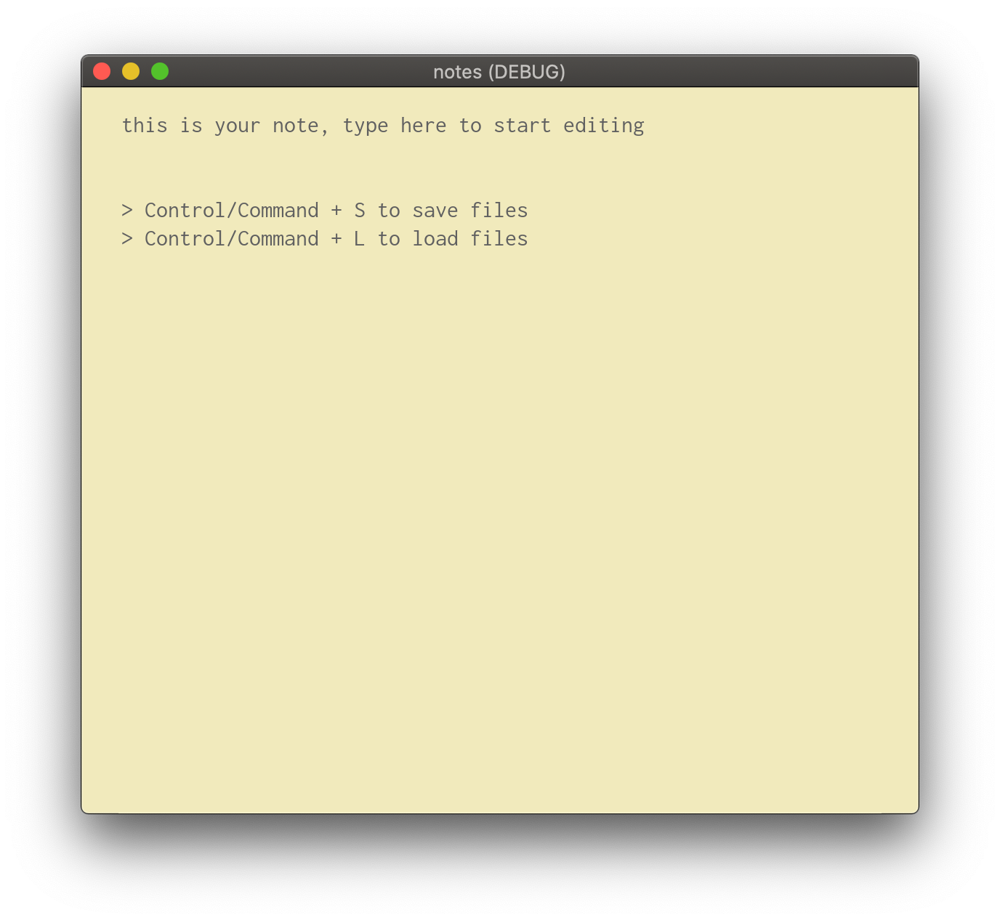
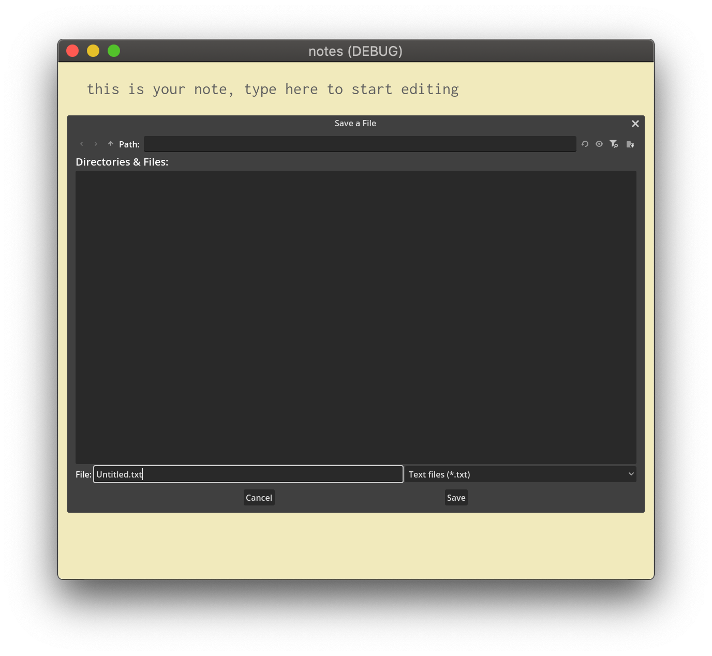
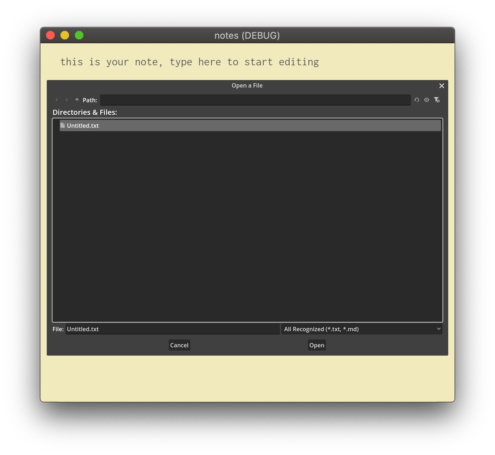

# Notes.gd

very basic notes app made in Godot

you can open/save .txt and .md files

to save: Command/Ctrl + S
to load: Command/Ctrl + L

## running

Clone the repository and run it in Godot (i only tested it in 4.4+)

## screenshots

